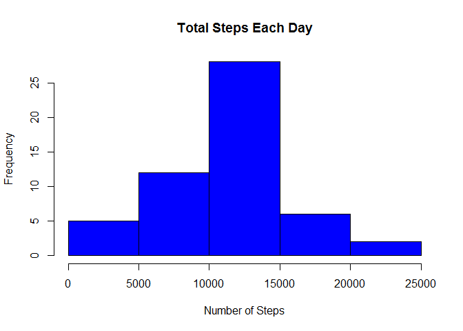

# Reproducible Research: Peer Assessment 1


## Loading and preprocessing the data

```r
if(!file.exists("activity.csv"))
{
  unzip("activity.zip")
}

activity <- read.csv("activity.csv")
```

Summary of the data is shown below

```
##      steps                date          interval     
##  Min.   :  0.00   2012-10-01:  288   Min.   :   0.0  
##  1st Qu.:  0.00   2012-10-02:  288   1st Qu.: 588.8  
##  Median :  0.00   2012-10-03:  288   Median :1177.5  
##  Mean   : 37.38   2012-10-04:  288   Mean   :1177.5  
##  3rd Qu.: 12.00   2012-10-05:  288   3rd Qu.:1766.2  
##  Max.   :806.00   2012-10-06:  288   Max.   :2355.0  
##  NA's   :2304     (Other)   :15840
```

## What is mean total number of steps taken per day?


###Calculate the total number of steps taken per day

```r
library(dplyr)
library(xtable)
```


```r
stepsbydate <- aggregate( steps ~ date, data = activity, sum)
```


```r
stepsbydatetable <- xtable(stepsbydate)
print(stepsbydatetable, type = "html")
```

<!-- html table generated in R 3.2.1 by xtable 1.7-4 package -->
<!-- Sun Sep 20 19:42:54 2015 -->
<table border=1>
<tr> <th>  </th> <th> date </th> <th> steps </th>  </tr>
  <tr> <td align="right"> 1 </td> <td> 2012-10-02 </td> <td align="right"> 126 </td> </tr>
  <tr> <td align="right"> 2 </td> <td> 2012-10-03 </td> <td align="right"> 11352 </td> </tr>
  <tr> <td align="right"> 3 </td> <td> 2012-10-04 </td> <td align="right"> 12116 </td> </tr>
  <tr> <td align="right"> 4 </td> <td> 2012-10-05 </td> <td align="right"> 13294 </td> </tr>
  <tr> <td align="right"> 5 </td> <td> 2012-10-06 </td> <td align="right"> 15420 </td> </tr>
  <tr> <td align="right"> 6 </td> <td> 2012-10-07 </td> <td align="right"> 11015 </td> </tr>
  <tr> <td align="right"> 7 </td> <td> 2012-10-09 </td> <td align="right"> 12811 </td> </tr>
  <tr> <td align="right"> 8 </td> <td> 2012-10-10 </td> <td align="right"> 9900 </td> </tr>
  <tr> <td align="right"> 9 </td> <td> 2012-10-11 </td> <td align="right"> 10304 </td> </tr>
  <tr> <td align="right"> 10 </td> <td> 2012-10-12 </td> <td align="right"> 17382 </td> </tr>
  <tr> <td align="right"> 11 </td> <td> 2012-10-13 </td> <td align="right"> 12426 </td> </tr>
  <tr> <td align="right"> 12 </td> <td> 2012-10-14 </td> <td align="right"> 15098 </td> </tr>
  <tr> <td align="right"> 13 </td> <td> 2012-10-15 </td> <td align="right"> 10139 </td> </tr>
  <tr> <td align="right"> 14 </td> <td> 2012-10-16 </td> <td align="right"> 15084 </td> </tr>
  <tr> <td align="right"> 15 </td> <td> 2012-10-17 </td> <td align="right"> 13452 </td> </tr>
  <tr> <td align="right"> 16 </td> <td> 2012-10-18 </td> <td align="right"> 10056 </td> </tr>
  <tr> <td align="right"> 17 </td> <td> 2012-10-19 </td> <td align="right"> 11829 </td> </tr>
  <tr> <td align="right"> 18 </td> <td> 2012-10-20 </td> <td align="right"> 10395 </td> </tr>
  <tr> <td align="right"> 19 </td> <td> 2012-10-21 </td> <td align="right"> 8821 </td> </tr>
  <tr> <td align="right"> 20 </td> <td> 2012-10-22 </td> <td align="right"> 13460 </td> </tr>
  <tr> <td align="right"> 21 </td> <td> 2012-10-23 </td> <td align="right"> 8918 </td> </tr>
  <tr> <td align="right"> 22 </td> <td> 2012-10-24 </td> <td align="right"> 8355 </td> </tr>
  <tr> <td align="right"> 23 </td> <td> 2012-10-25 </td> <td align="right"> 2492 </td> </tr>
  <tr> <td align="right"> 24 </td> <td> 2012-10-26 </td> <td align="right"> 6778 </td> </tr>
  <tr> <td align="right"> 25 </td> <td> 2012-10-27 </td> <td align="right"> 10119 </td> </tr>
  <tr> <td align="right"> 26 </td> <td> 2012-10-28 </td> <td align="right"> 11458 </td> </tr>
  <tr> <td align="right"> 27 </td> <td> 2012-10-29 </td> <td align="right"> 5018 </td> </tr>
  <tr> <td align="right"> 28 </td> <td> 2012-10-30 </td> <td align="right"> 9819 </td> </tr>
  <tr> <td align="right"> 29 </td> <td> 2012-10-31 </td> <td align="right"> 15414 </td> </tr>
  <tr> <td align="right"> 30 </td> <td> 2012-11-02 </td> <td align="right"> 10600 </td> </tr>
  <tr> <td align="right"> 31 </td> <td> 2012-11-03 </td> <td align="right"> 10571 </td> </tr>
  <tr> <td align="right"> 32 </td> <td> 2012-11-05 </td> <td align="right"> 10439 </td> </tr>
  <tr> <td align="right"> 33 </td> <td> 2012-11-06 </td> <td align="right"> 8334 </td> </tr>
  <tr> <td align="right"> 34 </td> <td> 2012-11-07 </td> <td align="right"> 12883 </td> </tr>
  <tr> <td align="right"> 35 </td> <td> 2012-11-08 </td> <td align="right"> 3219 </td> </tr>
  <tr> <td align="right"> 36 </td> <td> 2012-11-11 </td> <td align="right"> 12608 </td> </tr>
  <tr> <td align="right"> 37 </td> <td> 2012-11-12 </td> <td align="right"> 10765 </td> </tr>
  <tr> <td align="right"> 38 </td> <td> 2012-11-13 </td> <td align="right"> 7336 </td> </tr>
  <tr> <td align="right"> 39 </td> <td> 2012-11-15 </td> <td align="right">  41 </td> </tr>
  <tr> <td align="right"> 40 </td> <td> 2012-11-16 </td> <td align="right"> 5441 </td> </tr>
  <tr> <td align="right"> 41 </td> <td> 2012-11-17 </td> <td align="right"> 14339 </td> </tr>
  <tr> <td align="right"> 42 </td> <td> 2012-11-18 </td> <td align="right"> 15110 </td> </tr>
  <tr> <td align="right"> 43 </td> <td> 2012-11-19 </td> <td align="right"> 8841 </td> </tr>
  <tr> <td align="right"> 44 </td> <td> 2012-11-20 </td> <td align="right"> 4472 </td> </tr>
  <tr> <td align="right"> 45 </td> <td> 2012-11-21 </td> <td align="right"> 12787 </td> </tr>
  <tr> <td align="right"> 46 </td> <td> 2012-11-22 </td> <td align="right"> 20427 </td> </tr>
  <tr> <td align="right"> 47 </td> <td> 2012-11-23 </td> <td align="right"> 21194 </td> </tr>
  <tr> <td align="right"> 48 </td> <td> 2012-11-24 </td> <td align="right"> 14478 </td> </tr>
  <tr> <td align="right"> 49 </td> <td> 2012-11-25 </td> <td align="right"> 11834 </td> </tr>
  <tr> <td align="right"> 50 </td> <td> 2012-11-26 </td> <td align="right"> 11162 </td> </tr>
  <tr> <td align="right"> 51 </td> <td> 2012-11-27 </td> <td align="right"> 13646 </td> </tr>
  <tr> <td align="right"> 52 </td> <td> 2012-11-28 </td> <td align="right"> 10183 </td> </tr>
  <tr> <td align="right"> 53 </td> <td> 2012-11-29 </td> <td align="right"> 7047 </td> </tr>
   </table>

### Make a histogram of the total number of steps taken each day

```r
hist(stepsbydate$steps, main = paste("Total Steps Each Day"), col="blue", xlab="Number of Steps")
```

 

###Report the mean and median of the total number of steps taken per day

```r
activitymean <- mean(stepsbydate$steps)
activitymedian <- median(stepsbydate$steps)
```
The mean is 1.0766189\times 10^{4} and median is 10765

## What is the average daily activity pattern?

###Time series plot (i.e. type = "l") of the 5-minute interval (x-axis) and the average number of steps taken, averaged across all days (y-axis)

```r
stepsbyinterval <- aggregate( steps ~ interval, data = activity, mean)
plot(stepsbyinterval$interval, stepsbyinterval$steps, type = "l", xlab = "5 minute Interval", ylab = "Average Steps taken across Days", main = "Time Series Average Steps against Interval")
```

 

###Which 5-minute interval, on average across all the days in the dataset, contains the maximum number of steps?

```r
stepsbyintervalordered <- arrange(stepsbyinterval, desc(steps))
interval <- stepsbyintervalordered[1,1]
```
835 to 840  is the 5 minute interval containing maximum number of steps


## Imputing missing values


###Calculate and report the total number of missing values in the dataset (i.e. the total number of rows with NAs)

```r
missingValues <- filter(activity, is.na(activity$steps))
numberOfMissingValues <- length(missingValues$steps)
```
2304 are number of rows with missing data in the dataset (i.e. the total number of rows with NAs)


###Devise a strategy for filling in all of the missing values in the dataset. The strategy does not need to be sophisticated. For example, you could use the mean/median for that day, or the mean for that 5-minute interval, etc


###Create a new dataset that is equal to the original dataset but with the missing data filled in.

We will be filling the missing values with mean for that 5-minute interval

```r
insert_missing_values = function(x,y)
{
  if(is.na(x))
  {
    fillinginfo <- filter(stepsbyinterval, interval == y)
    return(ceiling(fillinginfo$steps))
  }
  return(x)
}
activity_non_missing <- mutate(activity, steps = mapply( insert_missing_values, steps, interval) )
```

###Make a histogram of the total number of steps taken each day and Calculate and report the mean and median total number of steps taken per day. Do these values differ from the estimates from the first part of the assignment? What is the impact of imputing missing data on the estimates of the total daily number of steps?


```r
stepsbydate <- aggregate( steps ~ date, data = activity_non_missing, sum)
hist(stepsbydate$steps, main = paste("Total Steps Each Day"), col="blue", xlab="Number of Steps")
```

 


```r
activity_non_missing_mean <- mean(stepsbydate$steps)
activity_non_missing_median <- median(stepsbydate$steps)
```
The mean is 1.0766189\times 10^{4} and median is 10765

The effect of imputting missing data is that both mean and median increases

Mean increases from 1.0766189\times 10^{4} to 1.0784918\times 10^{4}
Median increases from 10765 to 1.0909\times 10^{4}

## Are there differences in activity patterns between weekdays and weekends?

###Create a new factor variable in the dataset with two levels - "weekday" and "weekend" indicating whether a given date is a weekday or weekend day.

```r
weekday_factor = function(day){ 
  day_of_week = weekdays(as.Date(day)) 
  weekdays = c("Monday",    "Tuesday",   "Wednesday", "Thursday", "Friday" )
  if(day_of_week %in% weekdays)
  {
    return("weekday")
  }
  return( "weekend" )
  }

activity_non_missing_factor <- mutate(activity_non_missing, day_type = sapply( date, FUN = weekday_factor ))
```

###Make a panel plot containing a time series plot (i.e. type = "l") of the 5-minute interval (x-axis) and the average number of steps taken, averaged across all weekday days or weekend days (y-axis). See the README file in the GitHub repository to see an example of what this plot should look like using simulated data.

```r
dayTypeIntervalSteps  <- aggregate( steps ~ day_type + interval, data = activity_non_missing_factor, mean)
```


```
##    day_type interval     steps
## 1   weekday        0 2.2888889
## 2   weekend        0 0.2500000
## 3   weekday        5 0.5333333
## 4   weekend        5 0.1250000
## 5   weekday       10 0.2888889
## 6   weekend       10 0.1250000
## 7   weekday       15 0.3111111
## 8   weekend       15 0.1250000
## 9   weekday       20 0.2222222
## 10  weekend       20 0.1250000
```


```r
library("lattice")

xyplot(
    type="l",
    data=dayTypeIntervalSteps,
    steps ~ interval | day_type,
    xlab="Interval",
    ylab="Number of steps",
    layout=c(1,2)
)
```

 

This marks the completion of the assignment
